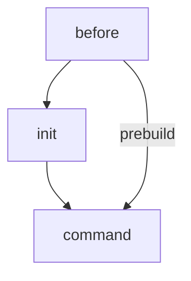

# Webitor - A web-based Code Editor

## Configuration

### Dockerfile

You can setup a customize Gitpod image using the _.gitpod.Dockerfile_. You are free to include any tools you need. 
Make sure the Dockerfile is referenced in _.gitpod.yml_ so that the changes will be applied.

### Gitpod configuration

The configuration for Gitpod is in the _.gitpod.yml_. 
The most commonly used sections of the file are:

| Section   | Description                                                   |
| --------- | ------------------------------------------------------------- |
| image     | choose an official image or reference the custom docker image |
| ports     | configure visibility and action when a TCP port is opened     |
| github    | configure prebuilds and other github features                 |
| gitconfig | configure git client                                          |
| vscode    | configure vscode and extensions                               |
| tasks     | define command that should be executed on startup             |

The tasks section devides into 3 subsections:

| Section | Description                                                                                     |
| ------- | ----------------------------------------------------------------------------------------------- |
| before  | commands that are executed before any other subsection (e.g. set env var)                       |
| init    | init commands (e.g. build, download dependencies, etc.) - is skipped when prebuilds are enabled |
| command | commands that are executed on startup (e.g. start webserver)                                    |

This is a simple diagram of the execution order:

More information can be found on the official documentation pages of Gitpod: 
[Official Gitpod documentation - .gitpod.yml](https://www.gitpod.io/docs/configure)
